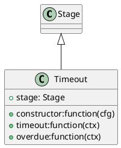

# Introduction

Take a look at the following:
1. [test1](./test1.md)
1. [test2](./test2.md)



```typescript

import * as fs from 'fs';
import * as child_process from 'child_process';

export class PlantUmlGenerator {
  private puSegments: RegExpMatchArray;

  /**
   * testMethod
   */
  public testMethod() {
    console.log(`say hello`);
  }

 
  /**
   * parses the content page and acquires PlantUML segments if present
   * 
   */
  public parsePage(content: string): boolean {
    this.puSegments = content.match(/^```plantuml((.*\n)+?)?```$/igm);
    console.log(this.puSegments);
    return (this.puSegments != null);    
  }
}

```

what does these things look like?