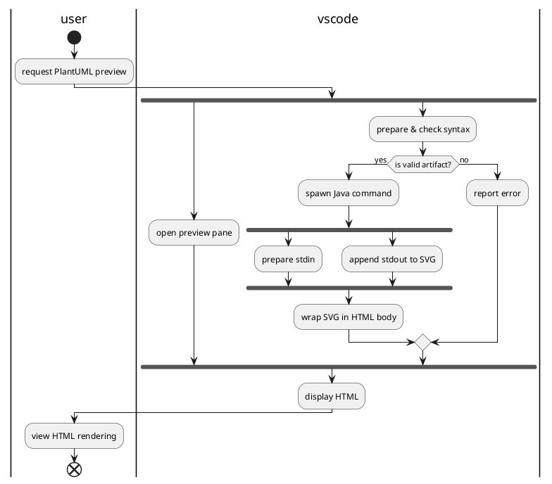
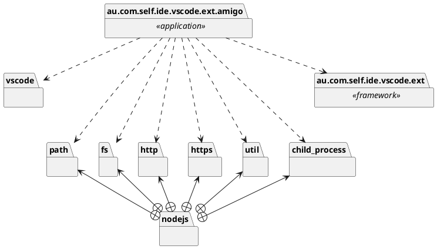

# this is a test

# first diagram

```plantuml
@startuml
|user|
start
:request PlantUML preview;
|vscode|
fork
:open preview pane;
fork again
:prepare & check syntax;
if (is valid artifact?) then (yes)
  :spawn Java command;
  fork
    :prepare stdin;
  fork again
    :append stdout to SVG;
  endfork
  :wrap SVG in HTML body;
else (no)
  :report error;
endif
endfork
:display HTML;
|user|
:view HTML rendering;
end
@enduml
```

## test

```plantumlcode
@startuml
class Test
@enduml
```

## second diagram

```plantuml
@startuml

package vscode {
}

package nodejs {
}

package path {
}

package fs {
}

package http {
}

package https {
}

package util {
}

package child_process {
}

fs <--+ nodejs 
path <--+ nodejs
http <--+ nodejs
https <--+ nodejs
util <--+ nodejs 
child_process <--+ nodejs 

package "au.com.self.ide.vscode.ext" as fw <<framework>> {
}

package "au.com.self.ide.vscode.ext.amigo" as amigo <<application>> {
}

amigo ...> fs
amigo ...> path
amigo ...> util
amigo ...> http
amigo ...> https
amigo ...> child_process
amigo ..> fw
amigo ..> vscode

@enduml
```

---

## References
* [Use-case example](test2.md)