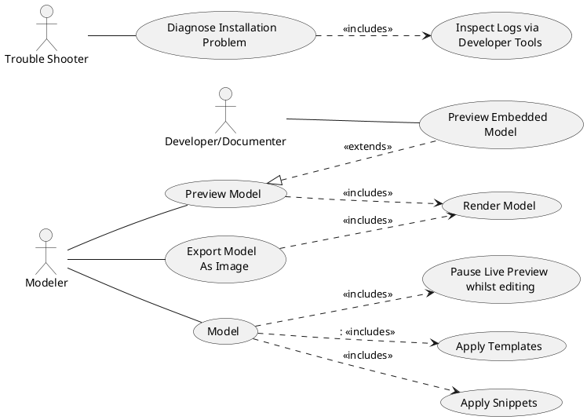

this is a use-case diagram

```plantuml
@startuml
left to right direction
(Preview Model) as PM
(Preview Embedded \n Model) as PEM
(Export Model \n As Image) as EM
(Render Model) as RM
(Pause Live Preview\n whilst editing) as PLP
:Modeler: -- PM
:Modeler: -- (Model)
:Modeler: -- EM
PM ..> RM: <<includes>>
EM ..> RM: <<includes>>

(Model) ..> (Apply Templates): : <<includes>>
(Model) ..> (Apply Snippets): <<includes>>

(Model) ..> PLP : <<includes>>

:Developer/Documenter: -- PEM
PEM .up.|> PM : <<extends>>

(Diagnose Installation \n Problem) as DIP
(Inspect Logs via \n Developer Tools) as ILDT
:Trouble Shooter: -- DIP

(DIP) ..> ILDT : <<includes>>
@enduml
```

Below is an image:

